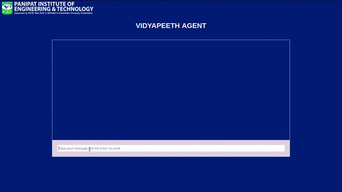

#dependencies needed to install before starting project

    npm install body-parser express dialogflow pusher dotenv node-fetch cors(in main directory)
    npm install pusher-js react-scroll(in vidyapeeth-agent directory)

#starting server

    node server.js (main directory)
    npm start(in vidyapeeth-agent directory)

# Video
